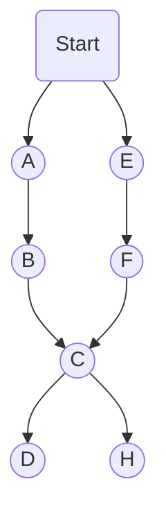

## 字典树


```
用字典树图形化表示为：
{
  ABCD
  EFCH
  EFCD
  ABCH
}
```




`Trie`又被成为前缀树、字典树。 字符串集合用字典树表示就像一个树。从每个值的第一位开始遍历。


`js`当中最适合保存字典树结构的是`Object`或者`Map`。

### 节点插入 insert

插入字典树节点的时候，检测有没有顺着当前边，没有的话新建一个新的节点。有的话沿着用之前的节点。

```js
let $ = Symbol('$')

insert(word) {
  let node = this.root
  for (let c of word) {
    // 没有当前字符串节点，新建一个
    if (!node[c]) {
      node[c] = Object.create(null)
    }
    // 用当前已有节点
    node  = node[c]

  }
  // 相同字符累加
  if (!($ in node)) {
    node[$] = 0;
  }
  node[$] ++
}

```    


## KMP

[字符串匹配的KMP算法](http://www.ruanyifeng.com/blog/2013/05/Knuth%E2%80%93Morris%E2%80%93Pratt_algorithm.html)