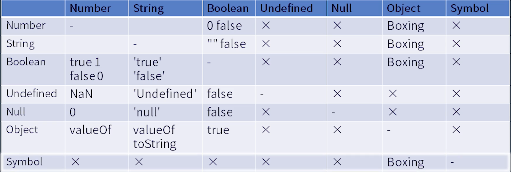

## js表达式

### 隐式转换




#### unboxing 拆箱转换

```js

var o = {
  toString() { return '2' },
  valueOf() { return 1 },
  [Symbol.toPrimitive]() { return 2}
}

```

> `console.log('x' + o)`
- 对象有`Symbol.toPrimitive`优先调用， 值为`x2`
- 没有`Symbol.toPrimitive`， 对象有`valueOf()`优先调用, 值为`x1`
- 最后调用`toString()`, 值为`x2`

> `var x = {}; x[o] = 1`
- 对象有`Symbol.toPrimitive`优先调用， 值为`x['2']`
- 最后调用`toString()`, 值为`x[2]`

#### boxing 装箱转换

| 类型   | 对象 | 值 |
|-------|-----|------|
| Number | new Number(1) | 1 |
| String | new String('a') | 'a' |
| Boolean | new Boolean(true) | Boolean |
| Symbol | new Object(Symbol('a')) | Symbol('a') |

#### 参考资料


[Javascript 隐式类型转换，一篇就够了！](https://chinese.freecodecamp.org/news/javascript-implicit-type-conversion/)